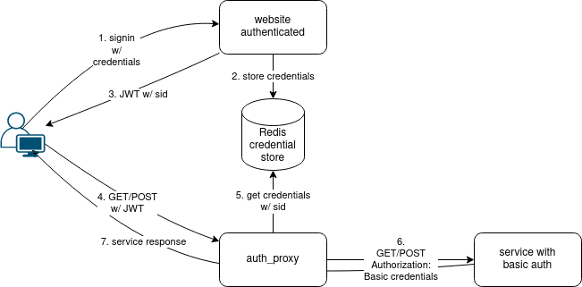

The site has moved [here](https://codeberg.org/iroco/hyper-auth-proxy).

---
As an organization that values the building of digital commons, we do not want to participate to the OpenAI/Microsoft LLM model development. 

1. We believe that this model is harmful to [human cognition](https://www.bloomberg.com/news/articles/2025-08-12/ai-eroded-doctors-ability-to-spot-cancer-within-months-in-study), [data privacy](https://jskfellows.stanford.edu/theft-is-not-fair-use-474e11f0d063), the [environment](https://iea.blob.core.windows.net/assets/ed0483fd-aab4-4cf9-b25a-5aa362b56a2f/EnergyandAI.pdf) (Copilot consumes [20.8W of power with 90% loss](https://arxiv.org/abs/2411.11892)), [misinformation](https://www.technologyreview.com/2023/10/04/1080801/generative-ai-boosting-disinformation-and-propaganda-freedom-house/), and all its biases: [colonialism](https://karendhao.com/), [racism](https://www.npr.org/2025/07/09/nx-s1-5462609/grok-elon-musk-antisemitic-racist-content), [sexism](https://www.unwomen.org/en/news-stories/interview/2025/02/how-ai-reinforces-gender-bias-and-what-we-can-do-about-it). We are not against AI, we are against the way AI is implemented with Copilot by GitHub and ultimately Microsoft and OpenAI. We use it (for example for translations) sparingly and conscientiously.

2. We do not want to contribute to the [techno-authoritarian stack](https://www.authoritarian-stack.info/) that is developing in the United States. We disapprove of Microsoft's involvement in the [hydrocarbon extraction companies](https://www.woodmac.com/horizons/ai-powered-analysis-oil-field-potential/). We don't understand the [version management policy](https://blog.iroco.co/windows10-the-end/) for Windows 10. Last but not least, we wish to maintain sovereignty over our IT stack.

Long version is [here](https://blog.iroco.co/pourquoi-quitter-github/).

---
Version Française

En tant qu'organisation qui valorise la construction de communs numériques, nous ne souhaitons pas alimenter les modèles LLM OpenAI/Microsoft. 

1. Nous pensons l'IA générative est délétère, pour la [cognition humaine](https://www.bloomberg.com/news/articles/2025-08-12/ai-eroded-doctors-ability-to-spot-cancer-within-months-in-study), le [respect des données](https://jskfellows.stanford.edu/theft-is-not-fair-use-474e11f0d063), l'[environnement](https://iea.blob.core.windows.net/assets/ed0483fd-aab4-4cf9-b25a-5aa362b56a2f/EnergyandAI.pdf) (l'utilisation de copilot représente une puissance de [20,8W avec 90% de perte](https://arxiv.org/abs/2411.11892)), la [désinformation](https://www.technologyreview.com/2023/10/04/1080801/generative-ai-boosting-disinformation-and-propaganda-freedom-house/), et tous ses biais : le [colonialisme](https://karendhao.com/), le [racisme](https://www.npr.org/2025/07/09/nx-s1-5462609/grok-elon-musk-antisemitic-racist-content), le [sexisme](https://www.unwomen.org/en/news-stories/interview/2025/02/how-ai-reinforces-gender-bias-and-what-we-can-do-about-it). Nous ne sommes pas contre l'IA en tant que telle, nous sommes contre la manière dont l'IA est mise en oeuvre avec Copilot par GitHub  et finalement Microsoft et OpenAI.

2. Nous ne voulons pas alimenter l'[écosystème techno-autoritaire](https://www.authoritarian-stack.info/) qui se met en place aux Etats-Unis. Nous réprouvons l'[aide aux sociétés extractives](https://www.woodmac.com/horizons/ai-powered-analysis-oil-field-potential/) d'hydrocarbures. Nous ne comprenons pas la politique de gestion de [version de Windows 10](https://blog.iroco.co/windows10-the-end/). Surtout, nous souhaitons conserver la souveraineté sur notre environnement informatique.

La version longue est [ici](https://blog.iroco.co/pourquoi-quitter-github/).
# hyper-auth-proxy [](https://circleci.com/gh/iroco-co/hyper-auth-proxy/tree/main)

---
A proxy to do http basic auth from a JWT token and redis session credentials




## usage

 Little auth proxy based on [hyper-reverse-proxy](https://github.com/felipenoris/hyper-reverse-proxy)
 that can be used to add Basic auth header for a backend service
 without having to send credentials base64 encoded on the web.

 It will use JWK token key `sid` field to seek for the credentials in a Redis instance. The JWT token is read from `Authorization`
cookie. The credentials are stored in json :

 ```json
 { "credentials": "dXNlcjp0ZXN0" }
 ```

 They can be used "as is" or the credentials can be encoded (for example with AES).

 Without encoded credentials, the proxy will make a request with `Authorization` header :
 ```bash
 Authorization: Basic dXNlcjp0ZXN0
 ```
 The main should contain a tokio main section and call the run_service function.

 Example :
 ```rust,no_run
 use hyper_auth_proxy::{run_service, ProxyConfig};

 #[tokio::main]
 async fn main() {
     let (_tx, rx) = tokio::sync::oneshot::channel::<()>();
     let config = ProxyConfig::default();
     let server = run_service(config.clone(), rx).await;
     println!("Running auth proxy on {:?} with backend {:?}", config.address, config.back_uri);
     if let Err(e) = server.await {
         eprintln!("server error: {}", e);
     }
 }

 ```

 The proxy configuration contains the following parameters :
 ```rust,no_run
  use std::net::SocketAddr;
  struct ProxyConfig {
     pub jwt_key: String,
     pub credentials_key: String,
     pub back_uri: String,
     pub redis_uri: String,
     pub address: SocketAddr,
 }
 ```

## logging && debugging

It uses log API so [for example](example/main_with_config.rs) with [env_logger](https://docs.rs/env_logger) it can be launched with 

```shell
$ RUST_LOG=debug hyper-auth-proxy
```

And you should have logs like : 

```shell
[2022-03-16T12:51:26Z INFO  my_auth_proxy] Running auth proxy on 127.0.0.1:3000 with backend "http://backend"
[2022-03-16T12:51:33Z DEBUG hyper_auth_proxy] cannot find auth cookie: no cookies header
[2022-03-16T12:53:21Z DEBUG hyper_auth_proxy] cannot find auth cookie: no auth cookie
[2022-03-16T12:53:35Z DEBUG hyper_auth_proxy] cannot decode jwt token: cannot decode jwt token (No claims component found in token string)
```
